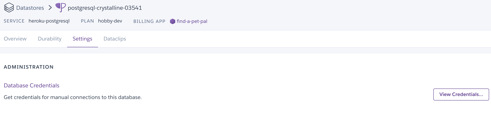

## Heroku Deployment

### Prerequisites

* Sign up for a [Heroku](https://www.heroku.com) account.

### Deploying an application

* In this activity, we will deploy a Pet Pals application to Heroku. The applications takes the name, latitude, and longitude of a pet and plot its location on a map. The actual code for the application is not nearly as important as the steps for deploying to Heroku. These steps can repeated for your own applications.

* This process consists of:

  1. Creating a repo for the application
  2. Preparing the application with additional configuration files (`Procfile` and `requirements.txt`) NOTE: We have provided these. For your future projects please keep the requirements.txt file as is. Add additional requirements if needed but do not change the current requirements.
  3. Creating the Heroku application
  4. Preparing the Heroku database

#### Part 1: Create a New Repo

* **Files:** [Pet Pals app](./Starter)

* On Github, create a new repo called **Pet_Pals** and clone it to your desktop.
* Add the starter files to this repo.

#### Part 2: Configuration Files

* Create a new conda environment for this app with the following code: 
  * All of our project dependencies will be installed in this environment.
  * **Note:** This should contain only python 3.7&mdash;and not anaconda.

    ```sh
    conda create -n pet_pals_env python=3.7
    ```

* Activate this new environment before proceeding.

  ```sh
  conda activate pet_pals_env
  ```

  * **Note:** If you run into issues, try the following command instead.  

    ```sh
    source activate pet_pals_env
    ```

* Next, install `gunicorn` using the command, `pip install gunicorn`. Explain to students that Gunicorn is a high-performance web server that can run their Flask app in a production environment.

* Because this app will be using Postgres, we will install `psycopg2` with `pip install psycopg2`. This will install `psycopg2` version 2.7.7. For future versions, i.e., 2.8, we will need to use `psycopg2-binary`. Install `psycopg2-binary` with `pip install psycopg2-binary`. 

* Install the remaining libraries into your new environment.

  ```sh
  pip install flask
  pip install flask-sqlalchemy
  pip install pandas
  ```

* Navigate to the folder that contains `initdb.py`, and run the following command to initialise the database:

  ```sh
  python initdb.py
  ```

* Next, to make the `run.sh` file executable, run the following command:

  ```sh
  chmod a+x run.sh
  ```
  You can also do this by checking the permissions on the file. Default should be executable but please make sure. 
* You can test the application by running the following in your command line.

  ```sh
  ./run.sh
  ```

* Navigate to `127.0.0.1:5000` to view your webpage and test out the app before deploying on Heroku. 

* This starter code uses a `.sqlite` file as the database, but you can also use `postgres` when we add the app to Heroku.

* To see all the data in the database, navigate to the API, `http://127.0.0.1:5000/api/pals`.

* Now that all of the project dependencies are installed, we need to generate the `requirements.txt` file. This file is a list of the Python packages required to run the app. Heroku will use this file to install all of the app's dependencies. **NOTE:** Only do this with new applications. For this test use the requirements file provided. Also note pip freeze additional commands and other commands like pip-chill and pipreqs. 

  ```sh
  pip freeze > requirements.txt
  ```

 ~~Important: In the `requirements.txt` file, downgrade `SQLAlchemy` to `SQLAlchemy==1.3.23`. This will avoid the `NoSuchModuleError: Can't load plugin: sqlalchemy.dialects:postgres` error from appearing and preventing your app from running.~~ 

* The final configuration file that we need is `Procfile`. This file is used by Heroku to run the app. **NOTE:** This section is already completed for you guys, instructions are left in markdown just in case. 

  ```sh
  touch Procfile
  ```

* Add the following code to the `Procfile`; this code will instruct Heroku how to run the app.
  
  ```sh  
  web: gunicorn pet_pals.app:app
  ```

  * In the code above, `pet_pals` is the name of the folder that contains your `app` as a python package (i.e., the name of the folder with the `__init__.py` file in it).

* Next, use git to `add`, `commit`, and `push` everything up to your repo.

#### Part 3A: Creating the Heroku App
**NOTE:** Heroku process is no longer working due to a hack. Please use the Heroku CLI to create the app.. This will allow you to do it through terminal, command prompt or git bash. Go to Part 3B to see this process.

* Navigate to [Heroku](https://www.heroku.com) and log into your account.

* Once you are at the main dashboard, click **New** in the top right and select **Create a new app**.

  * Give your app an unique name, and leave the region as the default value.

* On Heroku, go to the **Deploy** section of your app's homepage, and follow the steps to deploy the app.

  * In the **Deployment method** section, select **GitHub**, and your GitHub username should appear in the **Search for a repository to connect to** field. You can type “Pet_Pals” in the field that says **repo-name** or use the **Search** button to search for your pet-pals repo containing your code from the previous step.

    

  * Once the repo has been selected, click on **Connect**. 

    

  * Next, navigate to the **Manual deploy** section below, and click **Deploy Branch**.

    

  * Once you see the "Your app was successfully deployed" message, you can click on **View** to launch your Pet Pals webpage. 

    
  
    * **Note:** The database has not been set up yet, so there is one more step before it is fully functioning.

#### Part 3B: Creating the Heroku App through the CLI
1. Instal Herokus CLI 


2. Within the starter folder on your computer, start command prompt, terminal or git bash instance
From the local repository's root directory, enter these commands:
  
  ```sh
$ git pull origin
  ```
   This is to ensure the latest version is on your local computer.

  ```sh
$ git checkout branch-to-deploy
  ```
    This is to ensure you are on the correct branch to deploy.
  
  ```sh
$ heroku git:remote -a app-name
  ```
    This will create the heroku remote in your local repo for the app you wish to deploy to.
  ```sh
$ git push heroku branch-to-deploy:main
  ```
    This pushes the local branch to the Heroku app's git repository. 

#### Part 4: Preparing the Database ONLY FOR POSTGRES

* After creating a new app on Heroku, navigate to **Resources**:

  

* Under **Add-ons**, search `Heroku Postgres`. Make sure to use the free version, then click **Provision**.

  

* Once **Heroku Postgres** is added as your database, click on **Heroku Postgres**.

  

* Click on the **Settings** tab, then click on **View Credentials...**.

  

* The connection string to the database should now be available in the **URI** field:

  

* Heroku will automatically assign this URI string to the `DATABASE_URL` environment variable that is used within `app.py`. The code that is already in `app.py` will be able to use that environment variable to connect to the Heroku database.

  ```python
  # DATABASE_URL will contain the database connection string:
  app.config['SQLALCHEMY_DATABASE_URI'] = os.environ.get('DATABASE_URL', '')
  # Connects to the database using the app config
  db = SQLAlchemy(app)
  ```

* The final step requires the Heroku CLI. If students do not have it installed, please have them follow the instructions for installing the [Heroku CLI](https://devcenter.heroku.com/articles/heroku-cli).

* After adding the database, the final step is to initialise the database. To do this, we use the heroku CLI. From the terminal, type the following, making sure to replace `<name of your app>` with the name of your app as it appears in Heroku:

  ```sh
  heroku run python initdb.py -a <name of your app>
  ```

  * **Note:** In the `initdb.py` file, we have commented out `db.drop_all()`. If you would like to drop all the data from the database, you can uncomment this line, push the changes to GitHub, **Deploy Branch** on Heroku, and run `heroku run python initdb.py -a <name of your app>` again. 

* Your database is now initialised, and you can open the application using `heroku open -a <name of your app>` from the terminal or from **Open App** on the webpage.

* **Note:** When adding the pet's longitude, make sure you enter the negative value; otherwise, the data won't be populated on the US map. 
#### Part 5: Preparing Flask-API to Heroku
In order to deploy the python Flask-API to Heroku follow the steps below:
With your own project follow steps 1-3 above. You shouldn't need to do anything else aside from referencing the API in other sections of the website. For more information here ae some articles to follow:


